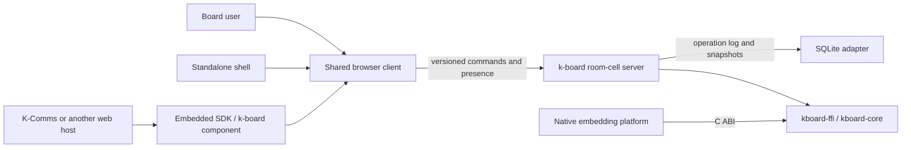
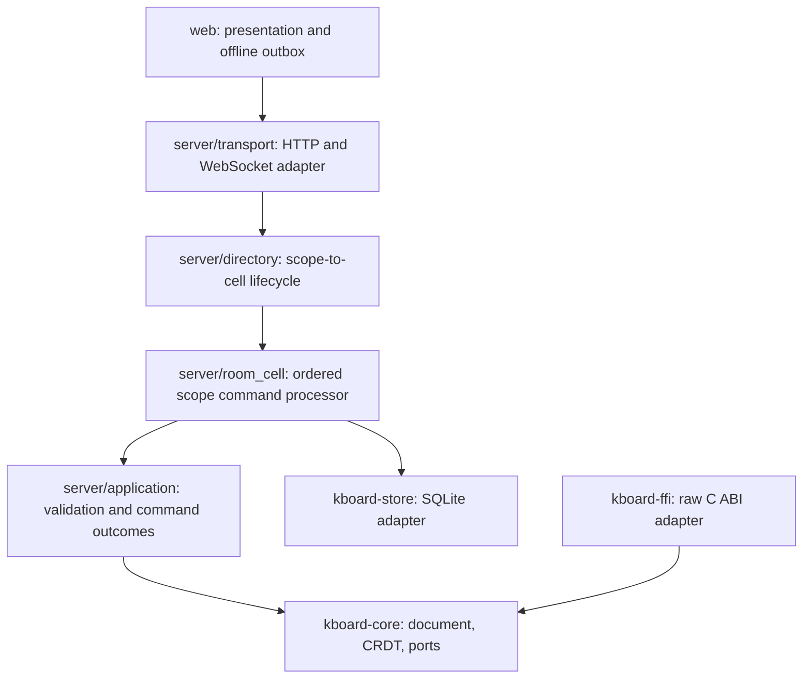
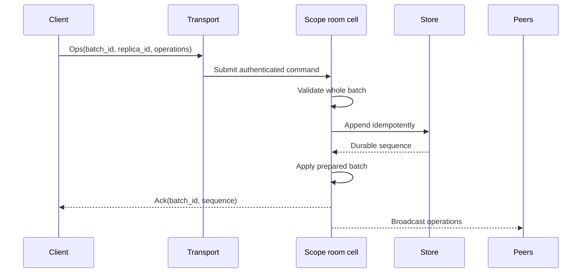
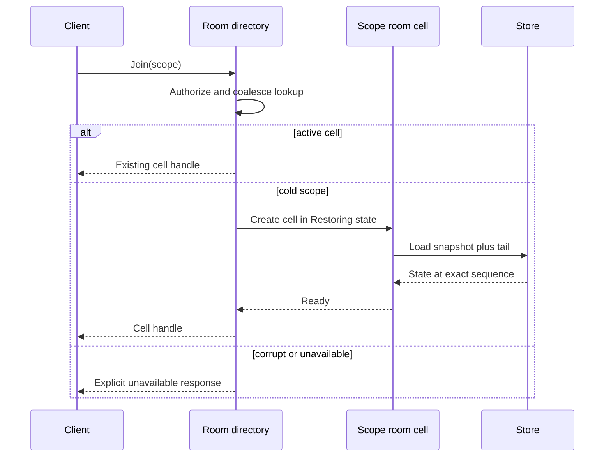

# k-board architecture

This document is the repository's architecture source of truth. It uses a
compact arc42 structure, C4-style boundaries, and decision records. It describes
the implemented architecture through Gate 10 plus the locally qualified Gate 11
delivery controls, and marks external delivery evidence that is not complete.

## 1. Purpose and quality goals

k-board is a multi-tenant collaborative canvas that can run as a standalone
application or as an embedded engine. Its primary quality goals, in priority
order, are:

1. **Convergence and data integrity** — accepted replicas converge; an
   acknowledged edit survives process restart.
2. **Tenant isolation and security** — a scope cannot read, mutate, or consume
   the mutable state of another scope.
3. **Fault isolation** — a hot, corrupt, or slow scope cannot stall unrelated
   scopes.
4. **Embeddability** — the core owns no clock, identity, storage, network, or
   authorization authority.
5. **Operability** — saturation, recovery, persistence, and degradation are
   observable and have bounded failure modes.
6. **Performance efficiency** — independent scopes execute concurrently while
   commands within one scope remain ordered.
7. **Changeability** — protocol, core, adapters, and presentation evolve behind
   explicit contracts and compatibility tests.

These goals interpret ISO/IEC 25010:2023 for this product. Trade-offs are
evaluated with concrete quality-attribute scenarios in the style of the SEI
Architecture Tradeoff Analysis Method (ATAM).

Reviewability uses advisory thresholds rather than hard line-count gates. See
[`docs/architecture/reviewability-standard.md`](architecture/reviewability-standard.md).

## 2. Constraints

- Rust 1.85 is the minimum supported toolchain.
- `kboard-core` is deterministic, safe Rust and free of ambient authority.
- Browser and native hosts use the same merge implementation through the raw C
  ABI.
- The standalone transport is HTTP/WebSocket and the durable adapter is SQLite.
- A scope is opaque to the engine and is the isolation key everywhere else.
- The current JSON wire format remains supported until a versioned replacement
  has a compatibility and migration plan.

## 3. Stakeholders and concerns

| Stakeholder | Main concerns |
|---|---|
| Board user | No lost edits, responsive collaboration, understandable recovery |
| Host integrator | Stable FFI, no ambient authority, tenant-safe boundaries |
| Operator | Bounded resources, readiness, recovery, backup, diagnostics |
| Security reviewer | Authentication, authorization, origin, input and tenant isolation |
| Maintainer | Explicit ownership, small decisions, reproducible tests and migrations |

## 4. System context

Trust boundaries exist at the browser/host input, WebSocket handshake, scope
authorization, FFI, and durable-store boundary. Authentication never substitutes
for scope authorization or input validation.

## 5. Architecture strategy

The target is a **per-scope room-cell modular monolith**:

- one deployable server process;
- modules with enforced dependency direction;
- one logical room cell per active scope;
- one bounded command mailbox and one ordered mutation owner per cell;
- concurrent execution across cells, never concurrent mutation inside one cell;
- storage, transport, identity, and telemetry behind explicit ports;
- durable acknowledgement before broadcast;
- lazy, coalesced restoration and bounded lifecycle management.

This is not a microservice-per-room design. Process and network boundaries are
introduced only when measured scale or fault-containment requirements justify
their operational cost.

## 6. Building-block view

### Module ownership

| Module | Owns | Must not own |
|---|---|---|
| `kboard-core` | CRDT, operations, snapshots, deterministic validation primitives, host ports | I/O, Tokio, SQLite, identity allocation, wall clock |
| `kboard-ffi` | Handle validation, panic containment, result buffers, board-handle synchronization | Collaboration policy, persistence, transport |
| `kboard-server` transport | Protocol parsing, authentication, connection lifecycle | Mutable board state, SQL transactions |
| `kboard-server` room cell | Scope command ordering, restore state, persistence/apply/broadcast sequence | Cross-scope mutable state |
| `kboard-store` | Log/snapshot transactions, migrations, recovery primitives | WebSocket or presentation concerns |
| `web` | Shared interaction/rendering, standalone bootstrap, Embedded SDK bridge, acknowledged outbox and reconnection UX | Host identity policy, server authority or durable-success inference from socket send |

## 7. Runtime views

### Edit command target flow

An error before the durable append yields a refusal and no visible mutation. A
failure after the append is recovered by replay; idempotent batch identity makes
client retry safe.

### Join and restore target flow

Restore never falls back to an empty board when durable state may exist.

## 8. Deployment view

The supported unit is one `kboard-server` process plus a SQLite database and
static web assets. The same unit serves the standalone shell at `/`, the
versioned embedded shell at `/embed`, and the framework-neutral SDK asset.
Development may use in-memory storage only when
the boot banner states that durability is disabled. Production readiness
requires an authenticated network boundary, writable persistent volume,
readiness checks, backup/restore evidence, and graceful drain.

Future horizontal scaling requires explicit scope placement, leased ownership
and storage fencing. A shared database alone does not make two writers safe.
ADR-0028 keeps one authoritative process until that protocol and its fault
evidence exist; the current measured envelope is 64 simultaneously writing
scopes, with bounded storage overload at 96 on the qualification workstation.

CI packages the server, native FFI libraries, wasm engine and browser assets as
one commit-addressed release candidate with a SHA-256 manifest. Promotion must
verify and reuse those exact bits; rebuilding in a target environment is not a
promotion. Packaging is not deployment evidence. A named target environment,
persistent data volume, secrets boundary, backup location and operator must
exist before target validation or production completion can be claimed.

## 9. Cross-cutting concepts

### Consistency and durability

- CRDT merge provides convergence, not persistence or transport delivery.
- Refusal is atomic for a batch.
- Stale/idempotent operations are valid accepted no-ops: offline replicas cannot
  reliably know whether a concurrent write has superseded them. Protocol-level
  duplicate batches are instead removed by the idempotency contract.
- Acknowledgement is an application-level durability fact, not a WebSocket-send
  fact.
- Snapshot coverage is captured with the document and never recomputed later.

### Command outcomes

| Internal outcome | Versioned protocol meaning | Connection behavior |
|---|---|---|
| Batch too large | Protocol/resource-limit refusal | Close after bounded error where possible |
| Invalid operation or key/value type | Permanent semantic refusal; no ack | Keep connection unless abuse policy trips |
| Room capacity exceeded | Capacity refusal; no ack | Keep connection so deletes/recovery remain possible |
| Durable store unavailable | Transient unavailable; no ack | Close/drain and retry the same batch identity later |
| Cell mailbox full | Transient overload with bounded retry guidance | Keep or close according to saturation policy |

Messages never expose storage paths, SQL text, token state, other replicas or
the existence of unauthorized scopes.

The browser durability states, IndexedDB bounds, fallback limitations and
support-assisted recovery path are normative in
[`docs/architecture/client-offline-recovery.md`](architecture/client-offline-recovery.md).

### Identity and clocks

Actor/replica identifiers participate in element IDs and HLC ordering. They are
therefore integrity data, not display-only connection metadata. Stable replica
identity, reconnect behavior, actor authorization, and future-clock handling are
specified by ADR before the protocol accepts durable offline retries.

### Security

Use least privilege at every scope boundary, validate all untrusted data, keep
bearers out of logs and persistent URLs, check WebSocket origin where browser
credentials are usable, and bound work by connection, identity, and scope. This
applies NIST SP 800-207 zero-trust principles without turning internal modules
into network services.

### Standalone and embedded delivery

The standalone shell and Embedded SDK are product modes over one client, not
separate editors. Standalone bootstrap owns its URL and navigation. Embedded
bootstrap receives an opaque scope and optional scope-bound grant over a
versioned private message channel. The host owns surrounding identity,
navigation, and the decision to request access; the k-board server still
enforces scope authorization, origin, durability, and resource policy.

The SDK's Web Component uses a sandboxed iframe as the first independently
deployable browser boundary. Only `/embed` may be framed, by `'self'` or exact
origins configured in `KBOARD_EMBEDDING_ORIGINS`; the standalone page remains
non-frameable. Cross-origin resource headers are limited to the public SDK
module, its contract dependency, and component stylesheet. ADR-0030 defines
lifecycle, token handling, alternatives, and revisit triggers.

The reusable repository threat model is
[`docs/security/threat-model.md`](security/threat-model.md). Public configuration,
resource ceilings and response signals are defined in
[`docs/security/deployment-and-incidents.md`](security/deployment-and-incidents.md).

### Observability

Metrics are bounded-cardinality and separate directory, mailbox, validation,
storage, restore, snapshot, broadcast, and client-ack latency. Scope identifiers
are not raw metric labels. Logs correlate connection, safe scope hash, replica,
batch, and durable sequence without exposing secrets.

The native FFI registry is process-global only for handle identity. Each value
is an independently synchronized board; lookup releases the registry before
mutation or serialization. Close detaches future lookup while an operation that
already cloned the handle may finish.

### Production lifecycle

Liveness, readiness, degraded diagnostics, admission stop, bounded cell drain,
storage flush, online backup and isolated restore verification are distinct
states. The normative probes, alert thresholds, recovery objectives, migration
and incident procedures are in
[`docs/operations/production-lifecycle.md`](operations/production-lifecycle.md).
Immutable packaging, promotion evidence and schema-compatible rollback are
governed by ADR-0029.

## 10. Architecture decisions

Accepted and proposed decisions are indexed in [`docs/adr/`](adr/README.md).
The room-cell transformation and governed delivery are controlled by ADR-0015
through ADR-0029. Standalone and Embedded SDK delivery is controlled by
ADR-0030.

## 11. Quality scenarios and acceptance thresholds

| Attribute | Scenario | Required response |
|---|---|---|
| Integrity | Store append fails for scope A | A is not mutated/acked/broadcast; scope B proceeds |
| Isolation | Scope A snapshots 50,000 elements | Scope B command p99 remains within its defined SLO |
| Reliability | Socket closes after server commit but before ack | Retry is deduplicated and acknowledged without duplicate effects |
| Recoverability | Snapshot write races with later appends | Snapshot records only the exact covered sequence; replay loses no operation |
| Availability | Stored scope is corrupt | Join is explicitly unavailable; never replaced by empty state |
| Security | Authorized peer forges another actor or future HLC | Batch is refused or normalized according to the identity/clock ADR |
| Capacity | Cell mailbox is full | Command receives bounded overload response; memory stays bounded |
| Changeability | Old and new clients overlap during rollout | Negotiated compatible version or explicit upgrade refusal |

Numeric SLOs must be derived from checked-in baselines before the room-cell
implementation is declared complete.

## 12. Known risks and technical debt

- Scope mutation is isolated in bounded per-scope room-cell mailboxes, while a
  bounded single-writer queue preserves SQLite ordering. The remaining shared
  admission/directory locks protect only short metadata operations.
- Protocol v2 durably deduplicates and acknowledges batches, and the shipped
  browser retains them in its IndexedDB outbox until that acknowledgement.
- The v1 compatibility surface still uses process-local connection actors and
  cannot claim v2 replica/HLC integrity guarantees.
- Empty operation batches remain v1 compatibility no-ops and are explicit
  `invalid_batch` refusals in v2.
- Exact snapshot coverage, atomic prefix truncation and fail-closed restore are
  implemented. Snapshot storage no longer holds a server-wide document lock,
  but the originating cell awaits its bounded writer result before processing
  later same-scope commands; latency SLO work remains.
- The FFI registry is shared only for handle lookup; each board has its own
  lock, so unrelated handles do not serialize through one mutation lock.
- Schema migrations, WAL checkpoint health, storage-fault behavior and the
  tombstone horizon are explicit. Readiness and backup/restore drills remain
  later operational gates.

The ordered remediation and evidence gates are maintained in
[`docs/architecture/room-cell-modular-monolith-program.md`](architecture/room-cell-modular-monolith-program.md).

## 13. Standards traceability

| Source | Application here |
|---|---|
| ISO/IEC/IEEE 42010:2022 | Stakeholders, concerns, viewpoints, model correspondence, decisions |
| ISO/IEC 25010:2023 | Product quality goals and quality scenarios |
| SEI ATAM | Explicit trade-offs and measurable stimulus/response scenarios |
| iSAQB architecture documentation guidance | Context, building-block, runtime, deployment views and ADRs |
| NIST SP 800-207 | Continuous scope authorization and least-privilege trust boundaries |
| NIST SP 800-218 SSDF | Threat-aware design, review, dependency and release verification |
| CNCF and cloud well-architected guidance | Loosely coupled modules, resilience, observability and operational evidence |

Standards describe the architecture and required qualities; they do not mandate
microservices. The modular monolith is the lowest-complexity topology that meets
the present quality scenarios.
